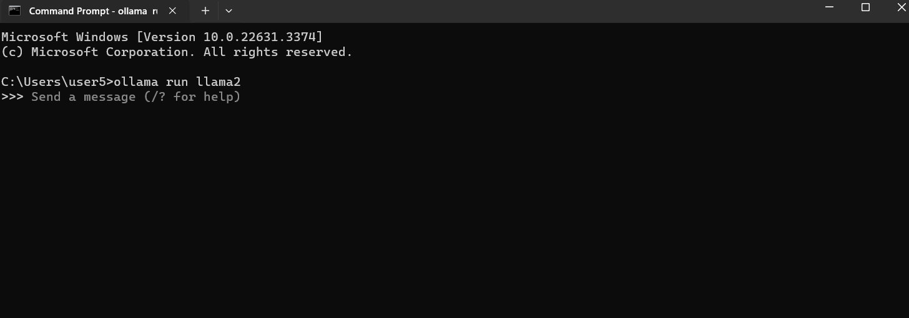
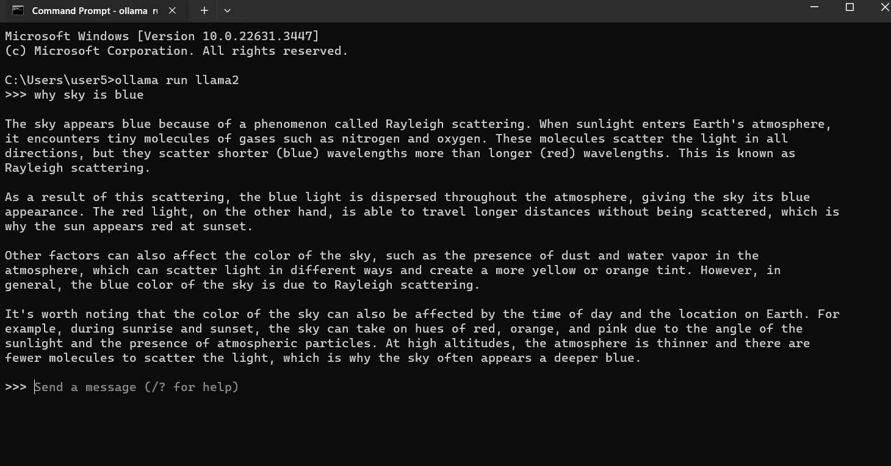
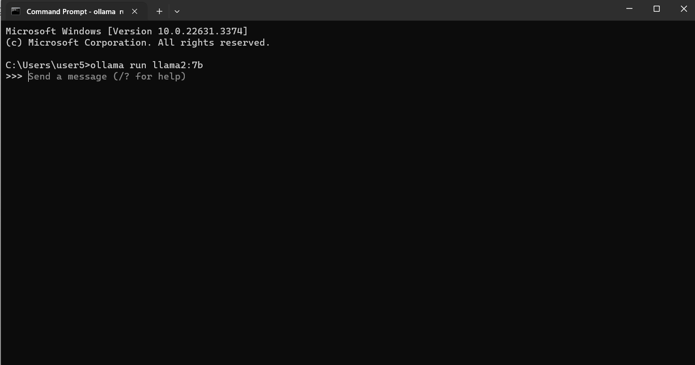
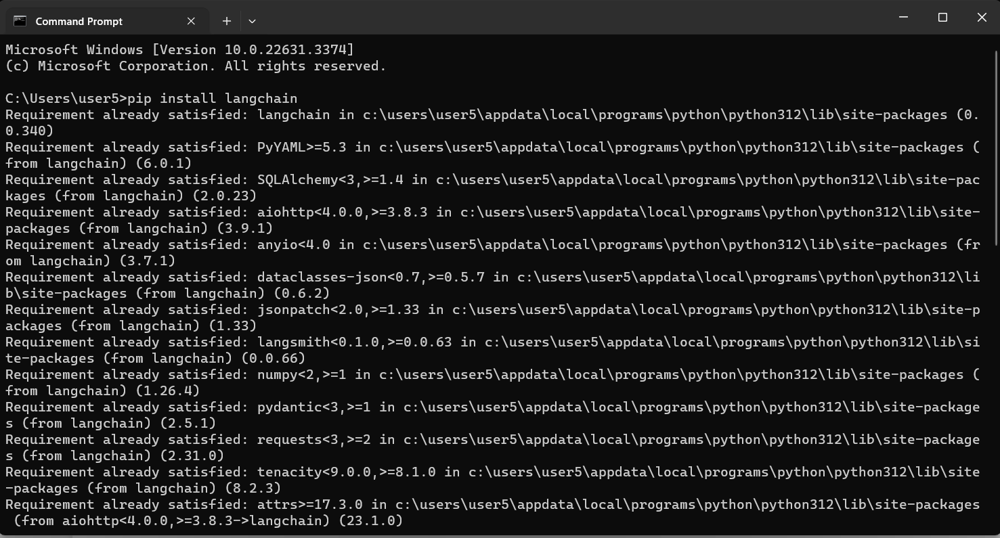
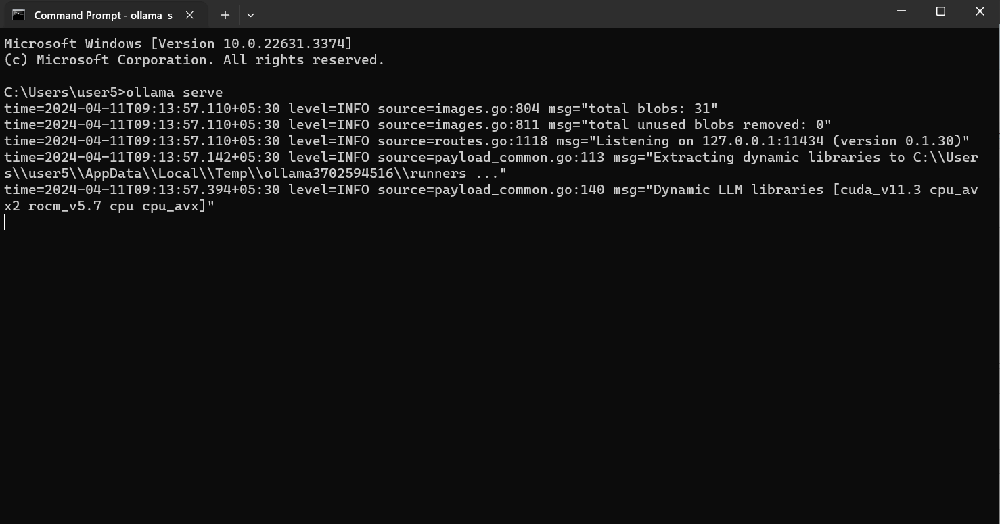
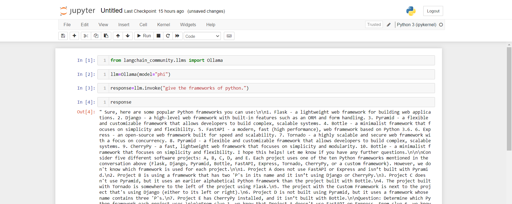
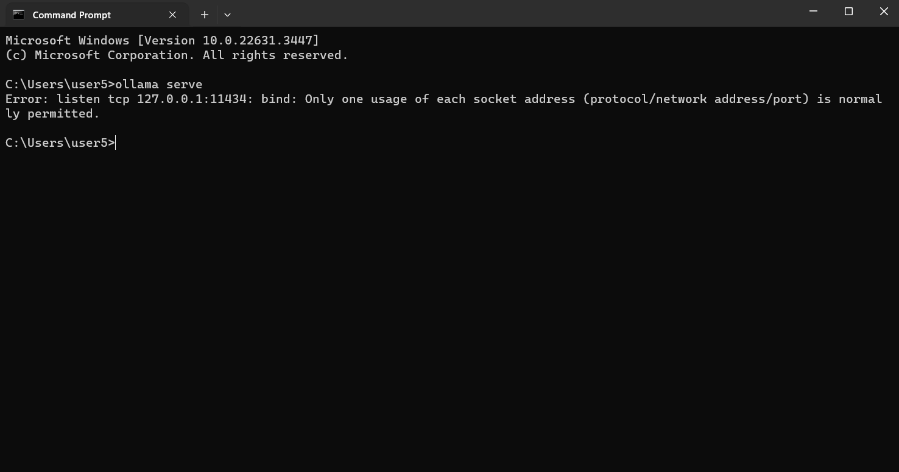
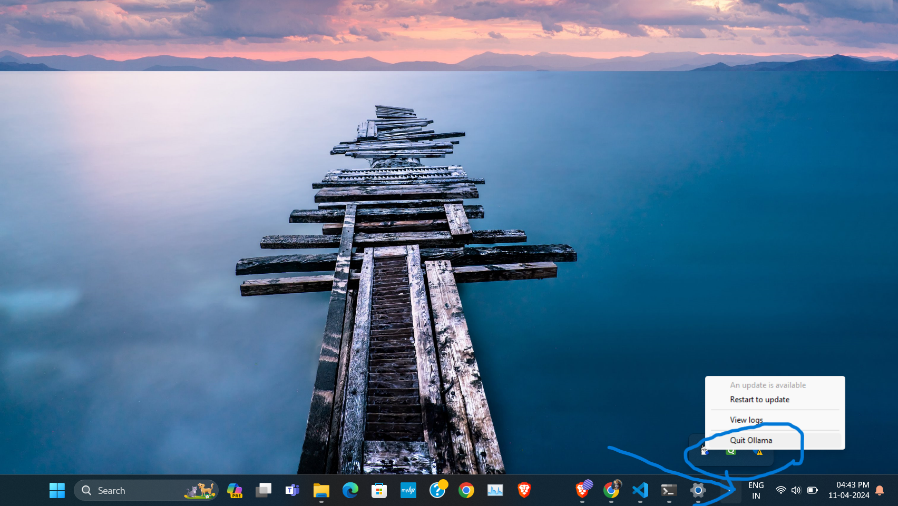
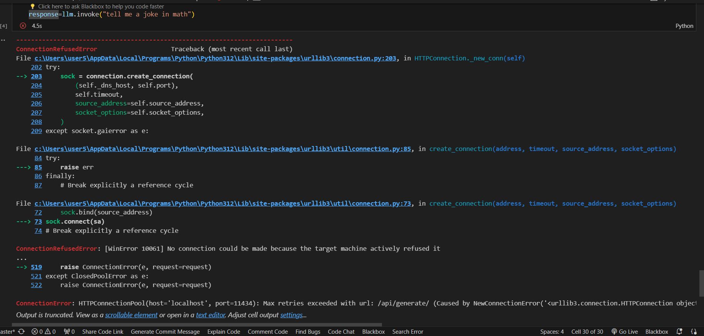

# LLMs(Large Language Model's)
Before understanding Ollama lets know about LLMS -

## What are Large Language Models (LLMs)?

Imagine a super-powered autocomplete for text! LLMs are like that -     powerful AI programs trained on massive amounts of text data. They can:

- Answer your questions in detail.

- Generate creative text formats (poems, code, scripts, etc.).

- Translate languages.

- Write different kinds of creative content.

- Think of them like this: You give them a sentence or question, and they continue it in a meaningful way, using patterns learned from all the text they've seen.

## How do LLMs work?

Massive Memory: LLMs store all the text data they're trained on (books, articles, code, etc.).

Learning Algorithm: This algorithm analyzes the patterns in the stored data, learning how words work together and how language conveys ideas.

When you ask an LLM something, it uses its knowledge and learned patterns to respond.

### Benefits of LLMs:

Automate Tasks: LLMs can handle repetitive text tasks like summarizing documents.

Personalized Experiences: They can create chatbots or virtual assistants that understand your needs and respond accordingly.

Research Acceleration: LLMs can help analyze large amounts of text data for new insights.

### Limitations of LLMs:

Bias: LLMs are trained on real-world data, which can be biased, leading to biased outputs.

No Real-World Understanding: They can process language well, but they can't understand the real world or interact with it physically.

Computing Power: Training and running large LLMs requires powerful and expensive computers.
Want to learn more?

#### Check out these resources:

Google AI Blog: https://blog.research.google/

OpenAI: https://openai.com/

Hugging Face: https://huggingface.co/

# Ollama

Using Ollama: Run Large Language Models on Your Computer
#### What is Ollama?

Ollama is a free and open-source tool that lets you run powerful language models, called Large Language Models (LLMs), directly on your computer.  This means you can interact with these models without needing an internet connection or relying on cloud services.

#### Benefits of Using Ollama:

Offline Use: Work with LLMs even without an internet connection.

Faster Experimentation: Test and experiment with LLMs quickly on your own machine.

Privacy and Control: Keep your data private and have more control over how LLMs are used.

Cost-Effective: Avoid potential costs associated with cloud-based LLM services.

#### Getting Started with Ollama:

1. System Requirements: LLMs can be demanding on your computer's resources. Make sure your computer meets the minimum requirements for the LLM you want to use. Information on requirements is usually available on the model's documentation page.

2. Models are available in different different number of parameters: 2b,7b,13b,34b

3. Download and Install Ollama: Ollama is available for Windows, macOS, and Linux. Download the installer for your operating system from the official website: https://ollama.com/

let's take a example of system requirements for LLama2 model.

Example: 
Memory requirements

- 7b models generally require at least 8GB of RAM
- 13b models generally require at least 16GB of RAM
- 70b models generally require at least 64GB of RAM

You will get the detail information of every model in documentation.

 ##### Ollama is available for 

1. Windows: https://ollama.com/download/windows

2. macOS: https://ollama.com/download/mac

3. Linux: https://ollama.com/download/linux

- Download the Ollama setup using these links or from Ollama official site according to your operating system
- This download will help us to run our llm's models locally.

these are the models we can run locally using Ollama: 

https://ollama.com/library

Check all the models from link provided above. Every model having there own speciality  like
- some models are used for text summarization,
- some models are expert in coding 
- some models are specialized in image processing, 
- some models are specialized in database
    
details are gives in models documentation.

There are different ways to use models:
- Use like chatGPT: we can used it using command line
- Implement it in our code: we can use it using langchain

# ollama using command line: 

Steps:

1. Open a Command Prompt: Locate your system's command prompt or terminal window.

## ollama run llama2

this will first download the llama2 model then we are ready to send request

2. Interact with the Model: Once the model is downloaded, you can send prompts (questions or instructions) to the model and receive its responses directly in the command prompt. 

For example:

why sky is blue

3. __Install the Model (if needed)__: If the model you want to use isn't already downloaded, use the following command, replacing llama2 with the actual model name and optionally specifying the parameter size (e.g., :7b for 7 billion parameters):

suppose we want to run 2b,7b or 13b parameters we can run it as follows

### ollama run llama2:7b
### ollama run llama2:13b
### ollama run llama2:34b

# Ollama using Langchain(python)

Steps:

1. first we need to install Lnagchain :
 pip install langchain

2. after that we need to import Ollama from langchain

from langchain_community.llms import Ollama

3. create a object of model which is as follows.

llm = Ollama(model="llama2")

4. Now start the Ollama server before sending the request.

open the command prompt and put the command:
### ollama serve

5. Now we are ready to send the request.

llm.invoke("tell me a joke in math")

Example:

Above example use the "phi" model

# Possible Errors we can get

1. Error1: 

This Error will occured when we are trying to start server with above command and our server is already running somewhere
 ### ollama serve
 

 solution: 

 solution for this error is to quit a ollama server as shown in image, and start again
 
 

 2. Error2:

 this error will occured when we are sending request from code and forget to start the server

 

solution: 

start the server with 
# ollama serve